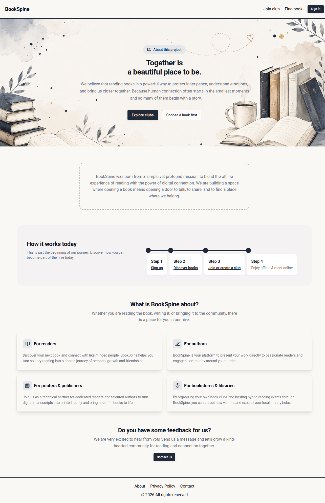

# BookSpine

**BookSpine** is a platform for online book clubs where users can interact through regular meetings—for example, via Zoom—as well as through an integrated live chat. Members can sign up on the platform, manage their own profiles, create a club or join an existing one, and communicate with other members via the live chat.

## Demo

🔗 [https://bookspine.net/](https://bookspine.net/)

## Preview

## Notes

This project was created for learning and demonstration purposes.

**API Cold Start:** The API server is hosted on a free tier and automatically goes to sleep after a period of inactivity. If the application doesn't respond immediately, please visit the website URL directly and wait a few moments (usually 60–120 seconds) for the server to spin up and become active again.
